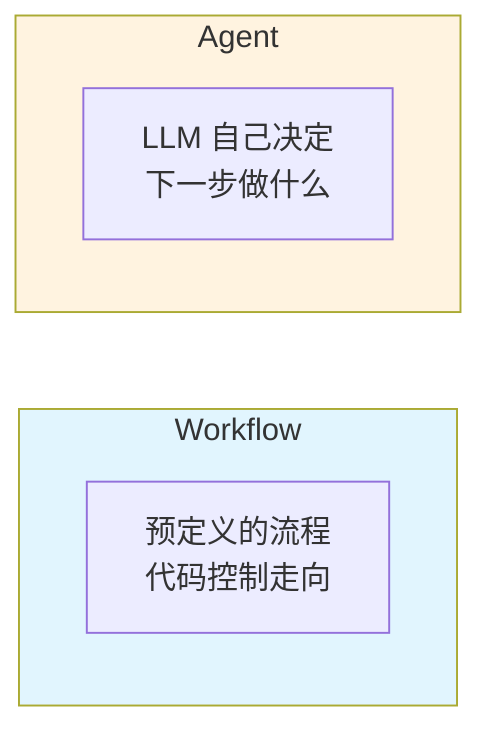
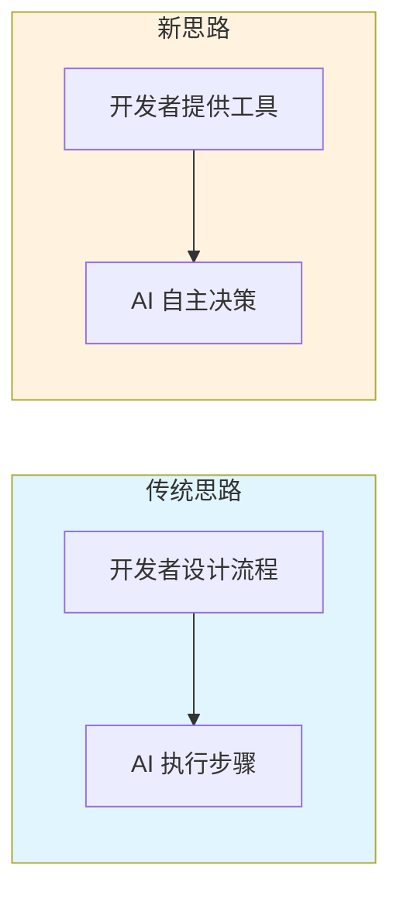
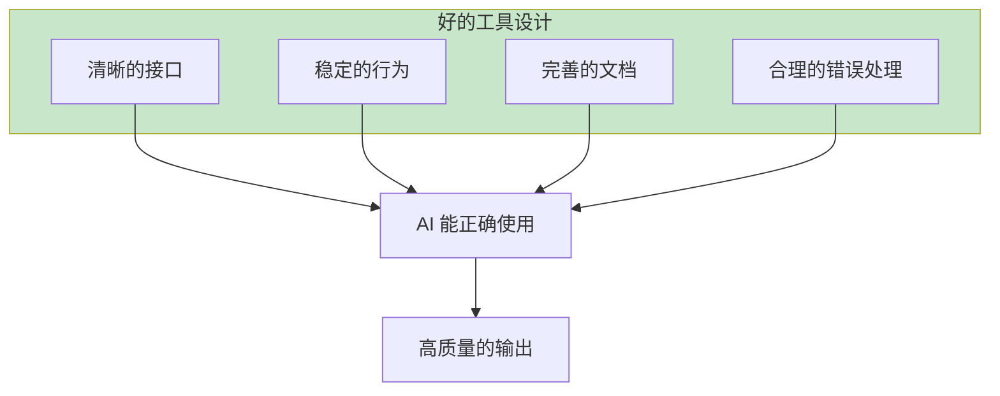

最近回顾了 Anthropic 的 [Building Effective Agents](https://www.anthropic.com/engineering/building-effective-agents)，这篇文章来自他们与几十个团队合作构建 LLM Agent 的实践经验。读完之后，有一个想法越来越清晰：**Agent 开发的核心应该是轻流程、重智能**。

## 文章说了什么

Anthropic 把 Agentic 系统分成两类：

**Workflow** 是你写好剧本让 LLM 演，**Agent** 是让 LLM 自己即兴发挥。

文章介绍了五种 Workflow 模式：

- **Prompt Chaining**：任务拆成一串步骤，一个接一个
- **Routing**：根据输入类型走不同分支
- **Parallelization**：多个 LLM 并行处理，汇总结果
- **Orchestrator-Workers**：一个 LLM 分配任务，多个 LLM 执行
- **Evaluator-Optimizer**：一个生成，一个评估，循环改进

以及真正的 Agent 模式——LLM 自己决定做什么、用什么工具、什么时候停下。

## 我的思考：轻流程，重智能

读完这篇文章，我在想一个问题：这些 Workflow 模式固然有用，但随着模型能力的提升，我们是不是应该把更多的决策权交给 AI 本身？

传统思路是：我们设计好流程，AI 按步骤执行。这当然可控，但也限制了 AI 的能力发挥。

新的思路是：我们专注于提供优质、稳定的工具，把逻辑路径的决策交给 AI 自己。

为什么这样更好？

**第一，模型能力在快速提升。** 今天需要用 Workflow 硬编码的逻辑，明天的模型可能自己就能判断。与其花时间设计复杂的流程编排，不如投入精力打磨工具的质量。

**第二，流程设计有天花板。** 再精心设计的 Workflow，也只能覆盖预想到的场景。但现实中的问题千变万化，让 AI 自主决策反而能处理更多长尾情况。

**第三，工具是可复用的资产。** 一个设计良好的工具，可以被不同的 Agent 在不同场景下使用。而一套 Workflow 往往只能解决特定问题。

## 工具设计才是核心

这也呼应了文章中我最认同的一个观点：

> **在 SWE-bench 上，我们花在优化工具的时间比优化 prompt 还多。**

工具就是 AI 的手和眼。工具设计得好，AI 才能发挥出真正的能力。

无论是通过 MCP（Model Context Protocol）提供工具，还是通过 Skill 的方式，核心都是一样的：**把工具做好，让 AI 自己决定怎么用**。

文章举了个例子：他们的 Agent 在相对路径上老是出错，改成强制用绝对路径后问题就解决了。这不是靠更复杂的流程，而是靠更好的工具设计。

## Agent 的未来

我相信 Agent 的发展方向是：

1. **流程越来越轻**：从硬编码的 Workflow，到越来越多的自主决策
2. **工具越来越重要**：工具的质量决定了 Agent 的能力上限
3. **人的角色转变**：从"流程设计者"变成"工具提供者"和"目标设定者"

当然，这不是说 Workflow 没有价值。在一些需要强可控性的场景（比如金融、医疗），预定义流程仍然是必要的。但对于大多数应用场景，让 AI 更自主可能是更好的选择。

---

*原文：[Building Effective Agents](https://www.anthropic.com/engineering/building-effective-agents)*
