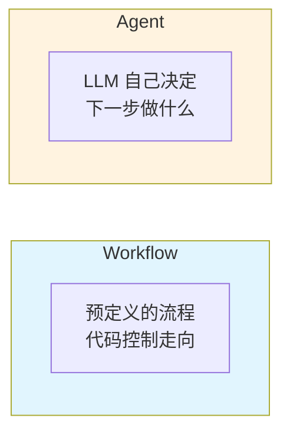
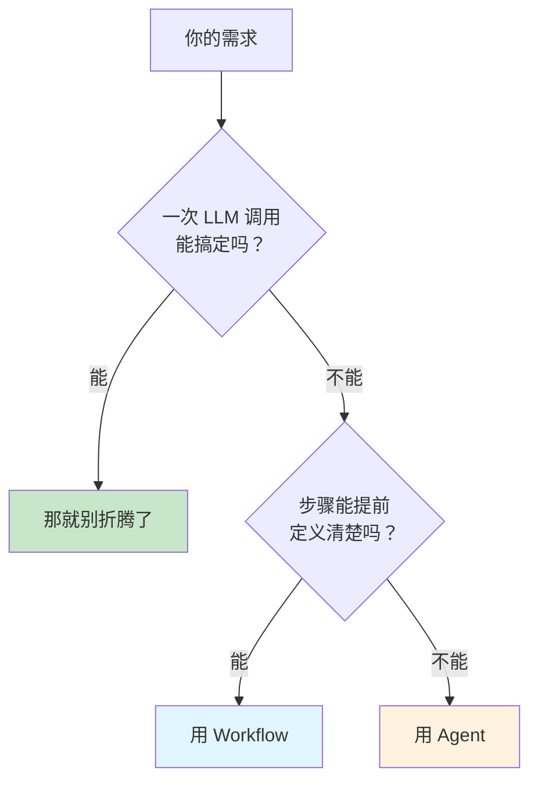
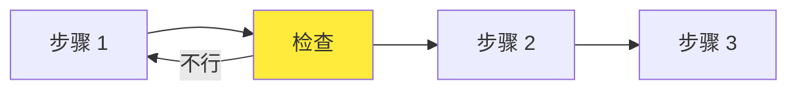
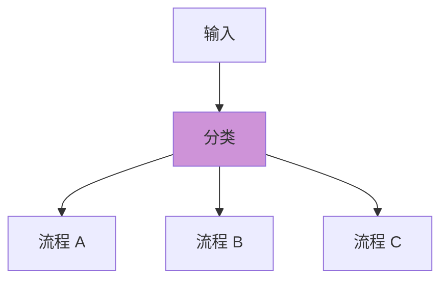
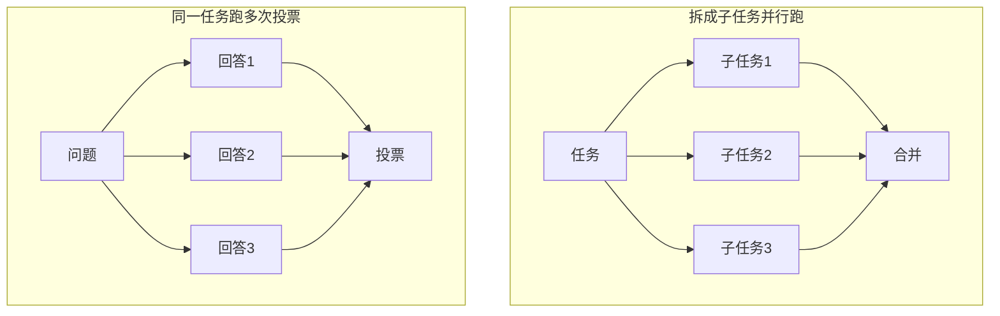
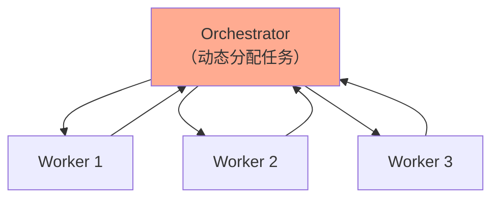
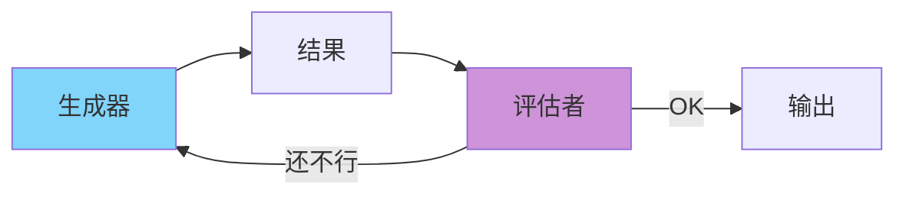
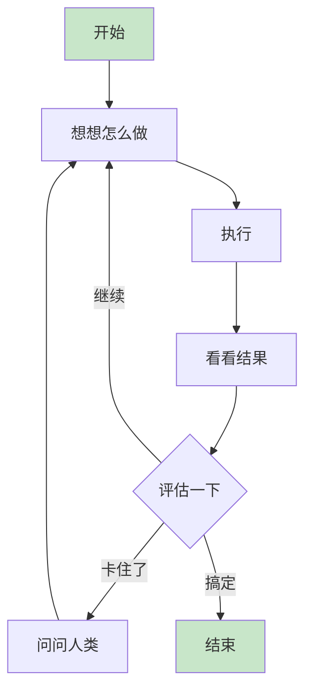

最近回顾了 Anthropic 的 [Building Effective Agents](https://www.anthropic.com/engineering/building-effective-agents)，这篇文章来自他们与几十个团队合作构建 LLM Agent 的实践经验。读完觉得有些地方挺有意思，记录一下。

## 一个反直觉的结论

文章开篇就抛出一个观点：

> **最成功的实现往往不是使用复杂框架，而是采用简单、可组合的模式。**

说实话，这和我观察到的现象有点矛盾。现在很多团队一上来就是 LangChain、LlamaIndex，各种框架堆上去，好像不用框架就显得不专业。

但 Anthropic 说，他们见过最好的实现反而是那些用"几行代码"直接调 API 的。为什么会这样？我猜可能是：框架抽象了太多细节，出问题的时候反而不知道哪里错了。而简单的实现，每一步都是透明的。

这让我想起软件工程里常说的 KISS 原则——不过说归说，真到自己做的时候，还是会忍不住想"预留一些扩展点"。

## Workflow 和 Agent 的区别

Anthropic 把 Agentic 系统分成两类：

简单说：Workflow 是你写好剧本让 LLM 演，Agent 是让 LLM 自己即兴发挥。

这个划分听起来清晰，但我觉得实际中没那么泾渭分明。很多系统其实是混合的——主干用 Workflow 保证可控，某些节点放开让 LLM 自己决策。就像导演拍戏，大部分按剧本走，但某些场景给演员留即兴空间。

## 什么时候该用什么

文章给了一个思路，我画成图大概是这样：

核心思想就是：别上来就整复杂的，能简单就简单。

不过文章没怎么提 Agent 的风险。我自己的感受是，一旦让 LLM 自己决定流程，事情就变得不太可控了——它可能会陷入循环、可能会产生幻觉然后一错再错。所以用 Agent 之前最好想清楚：出问题的代价你能接受吗？

## 五种 Workflow 模式

文章介绍了五种常见的 Workflow 模式，这部分算是干货了。

### Prompt Chaining

把任务拆成一串步骤，一个接一个：

比如：先写大纲 → 检查大纲是否合理 → 再写正文。

中间的"检查"环节挺关键的。太严了会反复重试浪费钱，太松了错误会往后传。

### Routing

根据输入类型，走不同的分支：

典型场景是客服系统：问价格的走一条路，要退款的走另一条路，技术问题又是一条路。每条路可以用专门优化过的 prompt。

文章没提一个问题：分类不可能 100% 准，总有些输入是模糊的。所以实际做的话，可能还得有个兜底流程。

### Parallelization

同时跑多个 LLM，然后汇总结果。有两种玩法：

投票这个思路听起来很美——多数人同意的答案应该更靠谱。但成本直接翻倍，而且如果三次都错呢？

我觉得与其跑三次投票，不如跑一次认真的 + 一次专门来挑刺的。

### Orchestrator-Workers

一个"老板" LLM 负责分配任务，多个"员工" LLM 干活：

和前面的并行化不同，这里的任务不是预先定好的，而是 Orchestrator 根据情况动态决定的。

这个模式的难点在 Orchestrator——它得能理解全局、知道怎么拆分、还得能综合各方结果。如果 Orchestrator 不够强，整个系统就垮了。

### Evaluator-Optimizer

一个生成，一个评估，循环改进：

这个模式我挺喜欢的，很像人写文章的过程——写一稿、改、再改。

但有个前提：迭代得能收敛。如果评估标准很模糊（比如"让文章更有趣"），可能会改来改去没有尽头。

## Agent：让 LLM 自己开车

Agent 是最灵活的模式，LLM 自己决定做什么、用什么工具、什么时候停下：

文章特别强调了一点：Agent 每一步都要能观察到真实的结果。代码 Agent 要真的跑代码看输出，搜索 Agent 要真的看搜索结果。

这个"接地"很重要。如果 Agent 只是在脑子里推演，很容易在幻觉里越走越远。真实的反馈是纠错的唯一来源。

## 工具设计比 Prompt 更重要

这是文章里我觉得最有价值的洞见：

> **在 SWE-bench 上，我们花在优化工具的时间比优化 prompt 还多。**

想想也是。模型用工具就像人用软件——如果软件设计得反人类，再聪明的人也会用错。

文章举了个例子：他们的 Agent 在相对路径上老是出错，后来改成强制用绝对路径，问题就没了。

这给我的启发是：与其费劲调 prompt 让模型"更小心"，不如把工具设计得让模型想错都难。

## 读完的感想

这篇文章让我印象最深的不是那些具体的模式，而是贯穿全文的一个态度：**保持简单，复杂性需要被证明**。

现在 AI 领域特别容易陷入"技术崇拜"——觉得越复杂越厉害、用的工具越多越专业。但 Anthropic 这篇文章反复在说：很多时候，一次 LLM 调用 + 好的 prompt + 合适的检索，就够了。

当然，说起来容易做起来难。谁不想在简历上写"构建了复杂的多 Agent 协作系统"呢？但如果一个简单的 prompt chain 就能解决问题，硬要上 Agent 就纯属自找麻烦了。

---

*原文：[Building Effective Agents](https://www.anthropic.com/engineering/building-effective-agents)*
