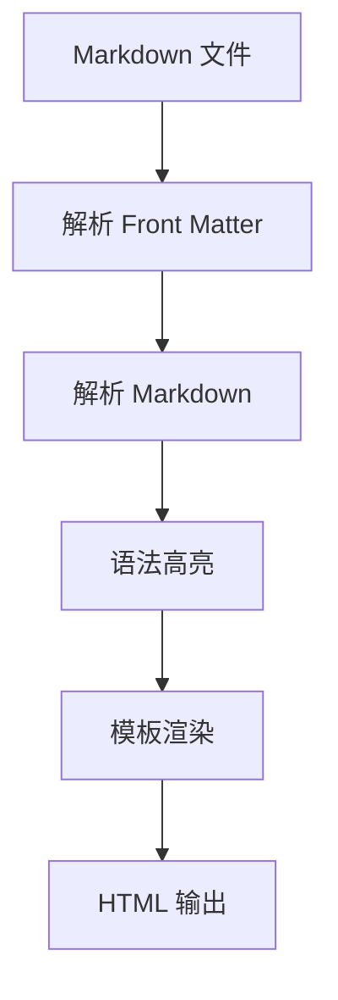

# 欢迎来到我的博客

这是使用 **xavierxcn-generator** 构建的第一篇博客文章。这个静态网站生成器使用 Rust 开发，专门为本博客定制。

## Markdown 功能展示

### 代码高亮

下面是一段 Rust 代码示例：

```rust
fn main() {
    println!("Hello, World!");

    let numbers: Vec<i32> = (1..=10).collect();
    let sum: i32 = numbers.iter().sum();

    println!("Sum of 1 to 10: {}", sum);
}
```

JavaScript 代码：

```javascript
const greeting = (name) => {
  return `Hello, ${name}!`;
};

console.log(greeting('World'));
```

### 表格

| 特性 | 支持情况 | 说明 |
|------|---------|------|
| 代码高亮 | ✅ | 使用 syntect |
| Mermaid | ✅ | 客户端渲染 |
| LaTeX | ✅ | KaTeX 渲染 |
| GFM 表格 | ✅ | 支持 |

### Mermaid 图表



### LaTeX 公式

行内公式：当 $a \ne 0$ 时，$ax^2 + bx + c = 0$ 的解为：

$$x = \frac{-b \pm \sqrt{b^2-4ac}}{2a}$$

欧拉恒等式：

$$e^{i\pi} + 1 = 0$$

### 引用

> 程序必须是为了给人看而写，给机器执行只是附带的。
>
> — Harold Abelson

### 任务列表

- [x] 初始化项目结构
- [x] 配置 Cargo.toml
- [x] 编写 openspec/project.md
- [ ] 实现 Markdown 解析
- [ ] 实现模板渲染
- [ ] 实现开发服务器

### 脚注

这是一个带有脚注的句子[^1]。

[^1]: 这是脚注的内容。

## 总结

这个博客生成器虽然只为本项目服务，但它将支持所有常见的 Markdown 扩展功能，包括代码高亮、Mermaid 图表、LaTeX 公式等。

感谢阅读！
