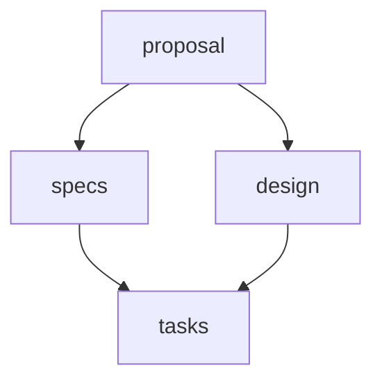
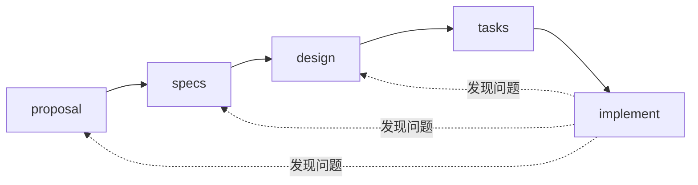
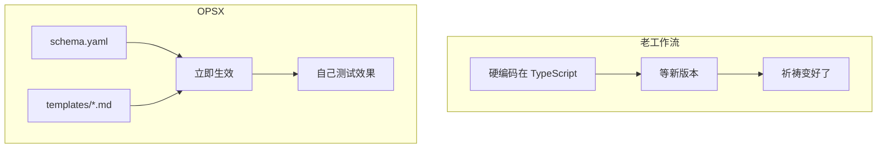
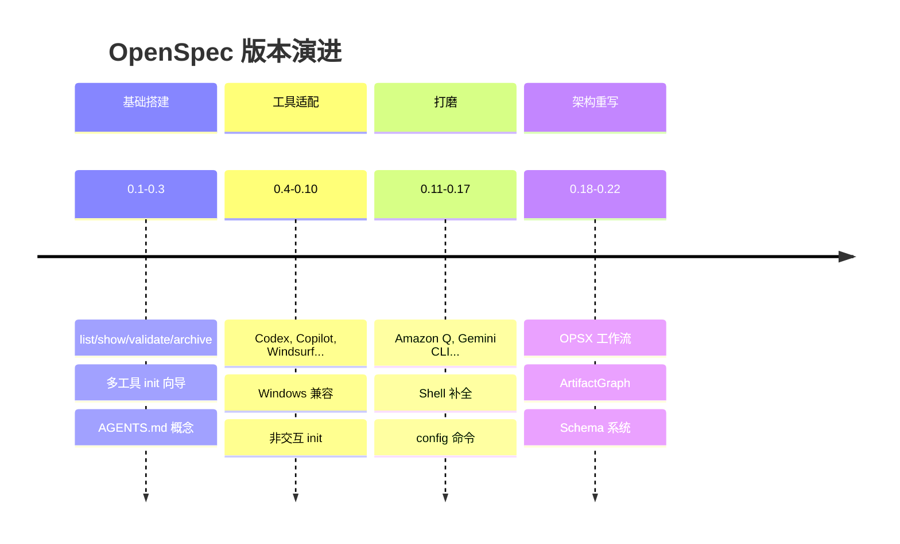

Vibe Coding 不好、规格驱动好——行，这些道理都懂，不多说了。

这篇想聊点别的：OpenSpec 1.0 在架构上做了哪些选择，为什么这些选择有意思，以及从 0.1 到 1.0 这一路它踩过什么坑、做过什么取舍。

## 文件系统当数据库用

翻 OpenSpec 的源码，第一个让我觉得有意思的设计是：它把文件系统当数据库。

没有 SQLite，没有 `.state.json`。判断 proposal 阶段有没有完成？看 `proposal.md` 存不存在就行了。

```typescript
if (exists(artifactPath)) {
  completed.add(artifactId)
}
```

就这么简单。

这带来几个好处：
- 每个命令都重新扫描文件系统，没有缓存状态会坏掉
- 所有状态都在文件里，Git 直接管，分支、合并都没问题
- 调试的时候 `ls` 一下就知道当前什么状态

很多工具喜欢搞一个 `.lock` 文件追踪状态，然后就会遇到各种状态不一致的问题——文件改了状态没更新，或者状态更新了但操作挂了一半。OpenSpec 的做法是：文件本身就是状态，不需要额外的状态层。

听起来有点笨？但有时候笨办法就是好办法。

## "依赖是启用器，不是门禁"

官方文档里有句话我觉得说得挺好：

> Dependencies are *enablers*, not *gates*.

一般的工作流系统喜欢设卡：你必须完成步骤 1 才能做步骤 2。OpenSpec 不这么干，它只告诉你：这些东西好了，所以你现在可以干这个了。



没有 proposal 你写不出有意义的 design——这是逻辑，不是官僚主义。但系统不会拦着你，它只是说：specs 和 design 现在能写了，tasks 还不行因为依赖 design。

这个区别对 AI 协作挺重要的。AI 不需要一个状态机告诉它"你现在在阶段 2"，它需要的是"这是你现在能做的事"。

## 老工作流 vs OPSX

这是 1.0 最大的变化。

### 老工作流有什么问题

0.1 到 0.17 这段时间，OpenSpec 用的是这套流程：

```
/openspec:proposal → /openspec:apply → /openspec:archive
```

用下来有几个痛点：

**指令全写死在代码里。** 想调整 proposal 的生成逻辑？得改 TypeScript 源码、重新编译、发新版本。

**一个命令全干完。** `/openspec:proposal` 一敲，proposal、design、tasks、specs 一股脑全出来了。没法单独调某一个环节。

**线性的，改不回去。** 实现到一半发现设计有问题，想回去改 design？没有官方的回退机制。要么手动改文件，要么重来。

### OPSX 改了什么

0.18 引入了 OPSX，1.0 把它扶正了。

核心变化是从"阶段"变成了"动作"：

| 命令 | 干嘛的 |
|------|--------|
| `/opsx:new` | 开一个新变更 |
| `/opsx:continue` | 根据依赖图，创建下一个产物 |
| `/opsx:ff` | 快进，一口气把规划产物都建了 |
| `/opsx:apply` | 开始实现，随时能回去改产物 |
| `/opsx:archive` | 完事了归档 |

关键区别在这：



实现到一半发现设计有问题？直接改 design.md 然后继续。不用重开变更，不用 hack。

还有一点，指令现在放在 `schema.yaml` 和 `templates/*.md` 里了：



想调整 proposal 的生成指令？改模板文件就行，不用动代码。

## ArtifactGraph 引擎

OPSX 的核心是个叫 ArtifactGraph 的东西，本质上是个依赖图引擎：

1. 读 `schema.yaml`，建 artifact 的依赖关系图
2. 扫文件系统，看哪些 artifact 已经有了
3. 用 Kahn 算法做拓扑排序
4. 告诉你现在能创建哪些 artifact

```typescript
const ArtifactSchema = z.object({
  id: z.string(),
  generates: z.string(),      // "proposal.md" 或 "specs/*.md"
  description: z.string(),
  template: z.string(),
  requires: z.array(z.string()).default([]),
});
```

`generates` 支持 glob。`specs/*.md` 意味着只要 `specs/` 目录下有 `.md` 文件，这个 artifact 就算完成了。

## Schema 系统

这个是 1.0 比较实用的新东西。

以前只有一种工作流：proposal → specs → design → tasks。现在可以自己定义：

```yaml
# 先调研再写 proposal
name: research-first
artifacts:
  - id: research
    generates: research.md
    requires: []

  - id: proposal
    generates: proposal.md
    requires: [research]

  - id: tasks
    generates: tasks.md
    requires: [proposal]
```

或者 TDD 风格的：

```yaml
name: tdd
artifacts:
  - id: spec
    generates: spec.md
    requires: []

  - id: tests
    generates: "tests/*.test.ts"
    requires: [spec]

  - id: implementation
    generates: "src/**/*.ts"
    requires: [tests]
```

Schema 解析走 XDG 标准：先找 `~/.local/share/openspec/schemas/<name>/`，没有再用包里内置的。不用 fork 项目就能完全自定义工作流。

## 项目配置

1.0 加了 `openspec/config.yaml`，解决一个实际问题：怎么让 AI 知道项目的约定？

```yaml
schema: spec-driven

context: |
  Tech stack: TypeScript, React, Node.js
  Testing: Vitest, Playwright
  我们用中文写注释

rules:
  proposal:
    - 要有回滚计划
  specs:
    - 场景用 Given/When/Then 格式
  design:
    - 复杂流程画时序图
```

这些内容会注入到每个 artifact 的生成指令里。AI 不用每次都被提醒"我们用 TypeScript"。

## 21 种 AI 工具

这个数字本身就说明问题：AI 编程工具的生态正在快速碎片化。

OpenSpec 的做法是生成适配层，不是给每个工具写一套实现：

- Claude Code: `.claude/skills/` 目录
- Cursor: slash commands
- GitHub Copilot: `.github/prompts/*.prompt.md`
- Windsurf: `.windsurf/workflows/*.md`

`openspec init` 选工具，它在对应目录生成配置。`openspec update` 刷新。底层逻辑一样，输出格式不同。

## 版本演进

翻 CHANGELOG 能看到演进轨迹：



1.0 本质上是把 OPSX 从"实验性"升级成"推荐"。

## 几个坑

用下来有些地方容易踩坑，记一下：

**Scenario 必须 4 个 `#`**

```markdown
#### Scenario: 用户登录成功   ✓ 对的
### Scenario: 用户登录成功    ✗ 会静默失败
```

**MODIFIED 要写完整内容**

改已有的 requirement，得把整个 requirement 复制过来改，不能只写增量。不然归档时会丢内容。

```markdown
## MODIFIED Requirements

### Requirement: 用户认证
The system SHALL issue a JWT on successful login.
The system SHALL validate token expiration.  <!-- 新增的 -->

#### Scenario: Valid credentials
...

#### Scenario: Expired token  <!-- 新增的 -->
...
```

**CLI 要显式参数，AI 负责推断**

```bash
openspec status --change add-auth   # CLI 要明确指定
```

AI 助手从对话推断当前处理哪个 change，然后传显式参数给 CLI。确定性执行和智能推断分开。

## 小结

OpenSpec 1.0 不只是个"让 AI 写代码更规范"的工具。它更像是一套 AI 协作的基础设施：有文件系统（specs 和 changes 的物理隔离）、有进程管理（artifact 依赖图）、有可编程接口（schema 系统）。

如果只是想让 AI "听话一点"，可能用不着这么重。但如果在认真想怎么把 AI 编程助手整进团队流程，OpenSpec 提供了一套打磨过的方案。

而且它开源、没有 API 密钥依赖、所有状态在本地文件。你能完全控制这套流程，不用把核心工作流托管给哪个 SaaS。

---

**链接**
- [GitHub](https://github.com/Fission-AI/OpenSpec)
- [OPSX 文档](https://github.com/Fission-AI/OpenSpec/blob/master/docs/experimental-workflow.md)
- [Schema 自定义](https://github.com/Fission-AI/OpenSpec/blob/master/docs/schema-customization.md)
- [Discord](https://discord.gg/YctCnvvshC)
